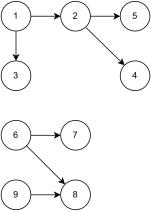

# @qiwi/toposort

Fork of [toposort](https://github.com/marcelklehr/toposort) with updated dependencies and some new features

## Why?

Toposort is wonderful, but we also need to know which parts of graph can be handled in parallel mode.

You can simultaneously handle unconnected parts (components in graph theory) of a graph.

Also, you can analyze dependencies and dependants of graph nodes to find independent nodes to parallelize their processing.

So, toposortExtra returns maps of dependencies and dependants and a list of graph components.

## Installation

```shell
yarn add @qiwi/toposort

npm i @qiwi/toposort
```

## Usage

### toposortExtra({ nodes, edges, throwOnCycle })

Returns an array of the graph components



The graph above is used in the code below.

```js
import { toposortExtra } from '@qiwi/toposort'

const res = toposortExtra({ edges: [[1, 3], [1, 2], [2, 4], [2, 5], [6, 7], [6, 8], [9, 8]] }) // see diagramm above

console.log(res)
/*
{
      sources: [1, 6, 9], // nodes which do not have incoming edges, e.g. dependencies/parents
      prev: new Map([ // map of dependencies
        [1, []],
        [3, [1]],
        [2, [1]],
        [4, [2]],
        [5, [2]],
        [6, []],
        [7, [6]],
        [8, [6, 9]],
        [9, []],
      ]),
      next: new Map([ // map of dependants
        [1, [2, 3]],
        [3, []],
        [2, [4, 5]],
        [4, []],
        [5, []],
        [6, [7, 8]],
        [7, []],
        [8, []],
        [9, [8]],
      ]),
      graphs: [ // list of graph components (unconnected parts)
        {
          nodes: [1, 2, 3, 4, 5], // list of component nodes
          sources: [1] // list of component start nodes 
        },
        {
          nodes: [6, 7, 8, 9],
          sources: [6, 9]
        }
      ]
    }
 */
```

The same result, but also checks edge nodes to be in the `nodes` list

```js
const res = toposortExtra({
  nodes: [1, 2, 3, 4, 5, 6, 7, 8, 9],
  edges: [[1, 3], [1, 2], [2, 4], [2, 5], [6, 7], [6, 8], [9, 8]]
})
console.log(res) // the same result
```

```js
const res = toposortExtra({
  nodes: [1, 2, 3, 4, 6, 7, 8, 9],
  edges: [[1, 3], [1, 2], [2, 4], [2, 5], [6, 7], [6, 8], [9, 8]]
}) // Uncaught Error: Unknown node. There is an unknown node in the supplied edges.
```

You can also check the graph to be acyclic 

```js
toposortExtra({
  edges: [[1, 2], [2, 3], [3, 1]],
  throwOnCycle: true
}) // Uncaught Error: Cyclic dependency, node was:1
```


### toposort(edges)

Marcelklehr's original toposort

```js
import toposort from '@qiwi/toposort' 

console.log(toposort([
    [ '3', '2' ],
    [ '2', '1' ],
    [ '6', '5' ],
    [ '5', '2' ],
    [ '5', '4' ]
  ]
)) // [ '3', '6', '5', '2', '1', '4' ]
```

### array(nodes, edges)

Marcelklehr's original toposort.array.

Checks edge nodes for presence in the nodes array

```js
import { array } from '@qiwi/toposort' 

console.log(array(
  ['1', '2', '3', '4', '5', '6'],
  [
    [ '3', '2' ],
    [ '2', '1' ],
    [ '6', '5' ],
    [ '5', '2' ],
    [ '5', '4' ]
  ]
)) // [ '3', '6', '5', '2', '1', '4' ]
```
