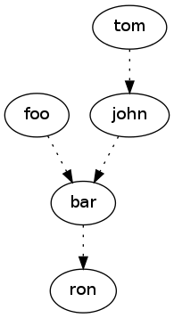

# Toposort

Sort directed acyclic graphs

[](https://travis-ci.org/marcelklehr/toposort)

## Installation

`npm install toposort` or `component install marcelklehr/toposort`  

then in your code:

```js
toposort = require('toposort')
```

## Example

Let's say you are compiling a project consisting of 5 modules. You know there are some dependencies between them so you want to figure a safe execution order to run them in. Lets assume we have tool which spits out dependency data for us:

```
var project = [
  {name: "foo", depends: ['bar']},
  {name: "bar", depends: ["ron"]},
  {name: "john", depends: ["bar"]},
  {name: "tom", depends: ["john"]},
  {name: "ron", depends: []}
]
```

Which if visualized in a graph:



reveals two safe execution orders:

+ `ron -> bar -> foo -> john -> tom`
+ `ron -> bar -> john -> tom -> foo`

Let's see if we can get `toposort` to figure that out for us. First though we need to translate the dependency information into something it can understand. The way `toposort` understands relationships is with edges. An "edge" is a 2 item `Array` where the first item is the subject and the 2nd item is the target.  

With edges our data looks like this: 

```js
var modules = [
  ["foo", "bar"],
  ["bar", "ron"],
  ["john", "bar"],
  ["tom", "john"]
]
```

Running it through `toposort` we get:

```js
var results = toposort(modules)

console.dir(results)
// => [ 'tom', 'john', 'foo', 'bar', 'ron' ]
```
So `toposort` prefered the first path through the graph. Since it was the first it encountered.

Now, we to get the best execution order, we can just reverse the returned array:

```js
console.dir(results.reverse())
// => [ 'ron', 'bar', 'foo', 'john', 'tom' ]
```

## API

### toposort(edges)

+ edges {Array} An array of directed vertices like `[node1, node2]` (where `node1` depends on `node2`) -- these needn't be strings but can be of any type

Returns: {Array} a list of nodes, sorted from least dependencies to most

### toposort.array(nodes, edges)

+ nodes {Array} An array of nodes
+ edges {Array} As with `toposort`. Edges doesn't necessarily need to contain all the items in `nodes`. However, the ordering of the items you don't mention will be undefined.

Returns: {Array} as per `toposort`

## Tests

Run the tests with `node test.js`.

## Legal

MIT License